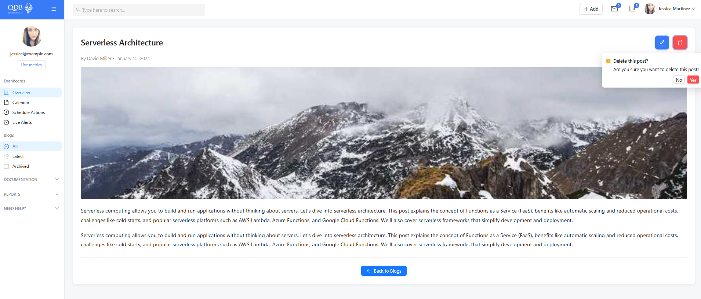

# Blog Management Application

A full-stack application for managing blog posts with a React frontend and Node.js backend.

## Table of Contents

- [Features](#features)
- [Screenshots](#screenshots)
- [Quick Start](#quick-start)
- [Installation](#installation)
- [Running the Application](#running-the-application)
  - [Backend](#backend)
  - [Frontend](#frontend)

## Features

- View all blog posts
- View detailed blog post information
- Create new blog posts
- Edit existing blog posts
- Delete blog posts
- Dashboard overview

## Screenshots

### Dashboard


### Blogs List


### Blog View


### Edit Blog


### Delete Blog


## Quick Start

For Windows users, the easiest way to start both the backend and frontend servers simultaneously is to use the provided batch file:

```bash
start-app.bat
```

This will:
- Open two command windows
- Start the backend server on [http://localhost:5000](http://localhost:5000)
- Start the frontend server on [http://localhost:5173](http://localhost:5173)

## Installation

### Prerequisites

- [Node.js](https://nodejs.org/) (v16 or higher)
- [Yarn](https://yarnpkg.com/) package manager

### Setup

1. Clone the repository:
   ```bash
   git clone <repository-url>
   cd <repository-directory>
   ```

2. Install backend dependencies:
   ```bash
   cd backend
   yarn install
   ```

3. Install frontend dependencies:
   ```bash
   cd ../frontend
   yarn install
   ```

## Running the Application

### Backend

1. Navigate to the backend directory:
   ```bash
   cd backend
   ```

2. Start the development server:
   ```bash
   yarn dev:watch
   ```

   The backend server will run on [http://localhost:5000](http://localhost:5000)

### Frontend

1. Navigate to the frontend directory:
   ```bash
   cd frontend
   ```

2. Start the development server:
   ```bash
   yarn dev
   ```

   The frontend will be available at [http://localhost:5173](http://localhost:5173) 